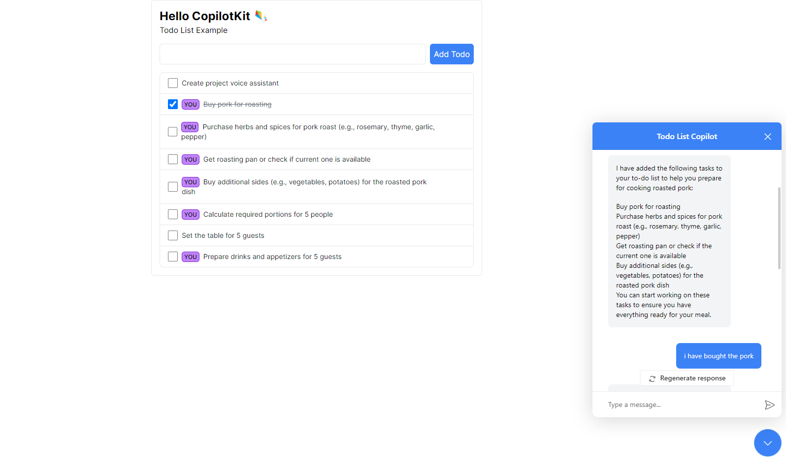

<p align="center">

</p>

## What is this?

This is a demo of [Copilotkit](https://docs.copilotkit.ai/getting-started/quickstart-chatbot) with OpenAI's GPT-4 to generate todo app list from human-langauge input.

## Add your OpenAI API key

Add your environment variables to `.env.local` in the root of the project.

```
OPENAI_API_KEY=your-api-key
```

## Install dependencies

```bash
npm install
```

## Run the development server

```bash
npm run dev
```

## Open the demo

Open [http://localhost:3000](http://localhost:3000) with your browser to see the result.


## The Copilot-Specific parts of the code:

1. Notice `<CopilotKit />` and `<CopilotPopup />` in `page.tsx`

2. Notice `useMakeCopilotReadable` in `page.tsx`

3. Notice the 2 `useCopilotAction` in `page.tsx`
